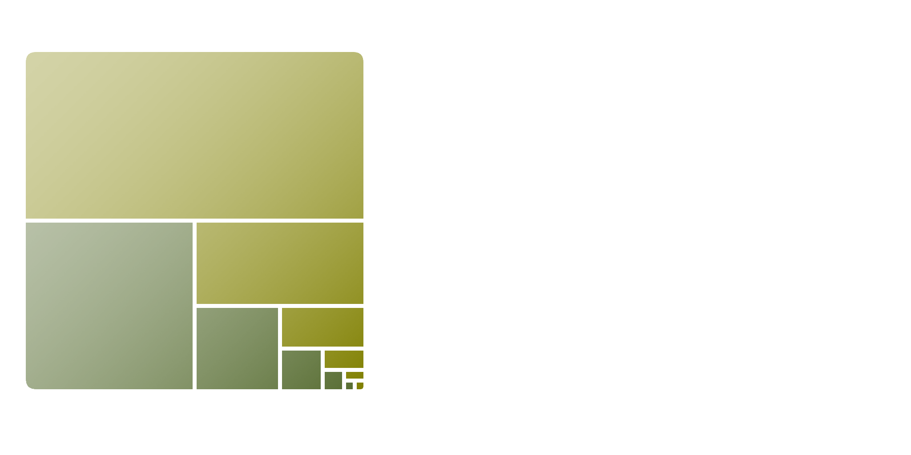

<p align=center>

</p>

[](https://ko-fi.com/erwan_lmt)

# Grimble: Gnome Tiling Window Manager

*This extension is still in development, bug reports and new feature enhancements/suggestions are welcome.*

You like GNOME? You like Tiling Window Managers? You can now have the best of both worlds with **Grimble**, the GNOME tiling window manager extension.

This extension provides the following features:
- Create new tile
- Move tile
- Resize tile
- Maximize tile
- Remove tile

||
|:--:|
|Tiles with Grimble|

**Grimble** is **flexible** with its easily **customizable keybindings** and its wide choice of options which let you build the tiling window manager you have always needed! But don't worry, if options and customizations frighten you, **Grimble** is ready to use. Grimble natively supports multiple monitors and workspaces.

*GNOME works with windows, do we really have tiles?* Yes and... no. This extension keeps GNOME windows (we build an extension, not a real window manager) but we endeavor to make it look as if you are dealing with a real tiling window manager!


## System Requirements
This extension is available on all Linux distributions using GNOME.

Currently supports GNOME **46, 47 and 48**.

## Installation

### Manual

Download the latest release of Grimble.
``` shell
gnome-extensions install grimble@lmt.github.io.shell-extension.zip
```

Once installed, the extension may not show up in the extensions list (especially with Wayland).
If that's the case, log out and log in.

Once installed you can enable the extension with the *Extensions* app or 
with the following command.

``` shell
gnome-extensions enable grimble@lmt.github.io
```
## Uninstall

``` shell
gnome-extensions uninstall grimble@lmt.github.io
```
or remove the extension with the GNOME Shell Extensions app.


## User Guide

Once the extension is installed, you can activate it with the `Extensions` app or via in command line. It will detect existing windows and tile them. It's now time to take a look at the extension settings. You can open the settings from the `Extensions` app or with the shortcut `Ctrl+Super+g`. The settings will show you all the keybindings (which can be modified) and general options of the extension.

**You are now ready to use Grimble!**

## Bug Reports

This extension is in its early days which means that it probably contains bugs. Please create an issue if you find new bugs.
When creating an issue you need to provide some information in order to help us fix it:
- Gnome Shell version (`gnome-shell --version`) and Grimble version.
- Describe how the bug is triggered (how we can reproduce it).
- **One issue = one bug**. Do not report multiple bugs in a single issue.

## Suggestions

This extension is not perfect, if you have suggestions to make it better, feel free to create issues to help improve this extension!
